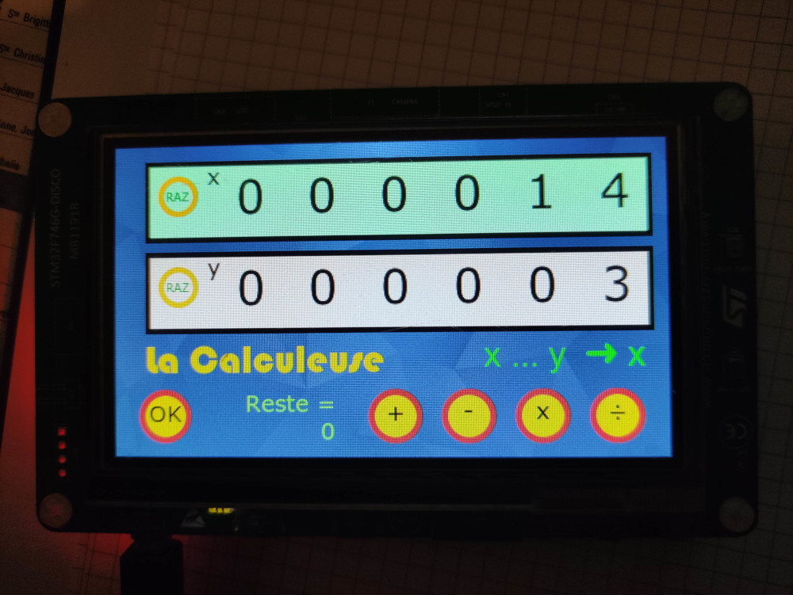

# La Calculeuse (on STM32F746G_DISCO kit)

"La Calculeuse" is a very **simple tactile calculator** for primary school kids.

  
It displays two numbers : X and Y, operates on these two numbers and shows the result in X.  
Each digit is shown on a wheel that can be scrolled with a finger to choose a number.  
That enables iterative calculations : +2 ... +2 ... +2 for instance.  
It works only with positive integers and have four operations : addition, substraction, multiplication and euclidian division (with remainder).  
The three types of error are managed : overflow, negative number, division by 0.  
There's a Youtube demo here :  
https://youtu.be/PU9Ylbjo0pk?si=GYXZqVtij_sRz8eB  

-------------------------------------------------------

**Framework** : TouchGFX 4.24.0  for graphic design + compilation + board flashing  
**IDE** : STM32CubeIDE 1.16.1 for editing code (compiled target from the IDE doesn't work on the board... !!!)  

The default IDE is set to STM32CubeIDE, to change IDE open the STM32F746G_DISCO.ioc with STM32CubeMX and select from the supported IDEs (EWARM from version 8.50.9, MDK-ARM, and STM32CubeIDE). Supports flashing of the STM32F746G_DISCO board directly from TouchGFX Designer using GCC and STM32CubeProgrammer.Flashing the board requires STM32CubeProgrammer which can be downloaded from the ST webpage. 

This TBS is configured for 272 x 480 pixels 16bpp screen resolution.  

Performance testing can be done using the GPIO pins designated with the following signals: VSYNC_FREQ  - Pin PB4(D3), RENDER_TIME - Pin PC6(D1), FRAME_RATE  - Pin PC7(D0), MCU_ACTIVE  - Pin PG6(D2)
 
---------------
